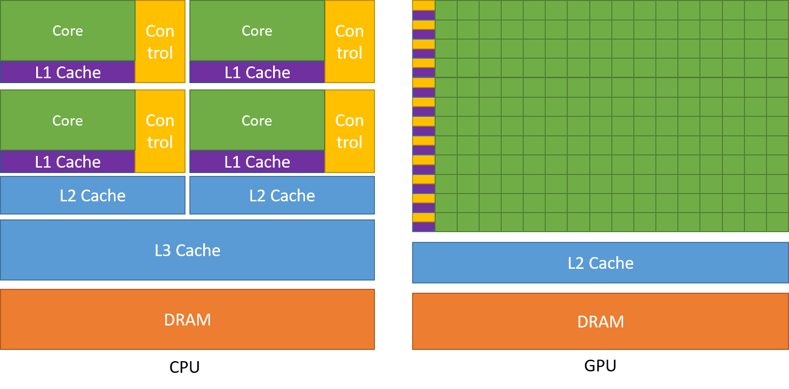

# CPUs, GPUs, and Parallel Computing

## Types of Processors

### 1. CPU (Central Processing Unit)

| Characteristic | Description |
|----------------|-------------|
| **Purpose** | General-purpose computing |
| **Clock Speed** | High (3-5+ GHz per core) |
| **Core Count** | Few (4-64 typically) |
| **Cache** | Large (L1, L2, L3 - up to 128MB+) |
| **Strength** | Complex sequential tasks |
| **Weakness** | Limited parallelism |

- Optimized for **low latency** (fast single-task completion)
- Large caches compensate for slow CPU-to-RAM transfers
- Each core can handle complex branching and logic
- Best for: Operating systems, applications, control flow

### 2. GPU (Graphics Processing Unit)

| Characteristic | Description |
|----------------|-------------|
| **Purpose** | Parallel data processing |
| **Clock Speed** | Lower (1-2 GHz) |
| **Core Count** | Thousands (RTX 4070: 5888 CUDA cores) |
| **Cache** | Small (shared across cores) |
| **Strength** | Massive parallelism |
| **Weakness** | Complex branching |

- Optimized for **high throughput** (many tasks per second)
- VRAM (Video RAM) has high bandwidth, reducing cache needs
- Simple cores execute the same instruction on different data (SIMD)
- Best for: Graphics, matrix math, deep learning, parallel algorithms

### 3. TPU (Tensor Processing Unit)

| Characteristic | Description |
|----------------|-------------|
| **Purpose** | Deep learning / AI |
| **Made by** | Google |
| **Specialty** | Matrix operations (tensors) |
| **Availability** | Cloud only (Google Cloud) |

- Designed specifically for neural network training/inference
- Faster than GPUs for certain deep learning workloads
- Not consumer-grade; available through cloud services

### 4. FPGA (Field Programmable Gate Array)

| Characteristic | Description |
|----------------|-------------|
| **Purpose** | Custom hardware logic |
| **Reconfigurable** | Yes (can be reprogrammed) |
| **Latency** | Very low |
| **Throughput** | Very high |
| **Cost** | High |
| **Power** | High |

- Hardware that can be reconfigured for specific tasks
- Used in: networking, signal processing, prototyping ASICs
- Offers hardware-level performance without custom chip fabrication

---

## Why GPUs Are Faster for Parallel Tasks



### CPU Architecture
```
┌─────────────────────────────────────────────────┐
│                    CPU                          │
│  ┌─────────┐ ┌─────────┐ ┌─────────┐ ┌───────┐ │
│  │ Control │ │ Control │ │ Control │ │Control│ │
│  │  Unit   │ │  Unit   │ │  Unit   │ │ Unit  │ │
│  ├─────────┤ ├─────────┤ ├─────────┤ ├───────┤ │
│  │  Cache  │ │  Cache  │ │  Cache  │ │ Cache │ │
│  ├─────────┤ ├─────────┤ ├─────────┤ ├───────┤ │
│  │  Core   │ │  Core   │ │  Core   │ │ Core  │ │
│  └─────────┘ └─────────┘ └─────────┘ └───────┘ │
│          (4-16 powerful cores)                  │
└─────────────────────────────────────────────────┘
```
- Large control units and caches take up space
- Fewer cores, but each can handle complex instructions
- Optimized for **sequential** workloads

### GPU Architecture
```
┌─────────────────────────────────────────────────────────────┐
│                           GPU                                │
│  ┌─────┐┌─────┐┌─────┐┌─────┐┌─────┐┌─────┐┌─────┐┌─────┐  │
│  │core ││core ││core ││core ││core ││core ││core ││core │  │
│  └─────┘└─────┘└─────┘└─────┘└─────┘└─────┘└─────┘└─────┘  │
│  ┌─────┐┌─────┐┌─────┐┌─────┐┌─────┐┌─────┐┌─────┐┌─────┐  │
│  │core ││core ││core ││core ││core ││core ││core ││core │  │
│  └─────┘└─────┘└─────┘└─────┘└─────┘└─────┘└─────┘└─────┘  │
│  ┌─────┐┌─────┐┌─────┐┌─────┐┌─────┐┌─────┐┌─────┐┌─────┐  │
│  │core ││core ││core ││core ││core ││core ││core ││core │  │
│  └─────┘└─────┘└─────┘└─────┘└─────┘└─────┘└─────┘└─────┘  │
│               (thousands of simple cores)                    │
│                    ┌────────────────┐                        │
│                    │  Shared Cache  │                        │
│                    └────────────────┘                        │
└─────────────────────────────────────────────────────────────┘
```
- Thousands of simple cores packed together
- Minimal control logic per core
- Optimized for **parallel** workloads

---

## CPU vs GPU: Design Philosophy

| Aspect | CPU (Host) | GPU (Device) |
|--------|------------|--------------|
| **Goal** | Minimize time of ONE task | Maximize tasks completed per second |
| **Metric** | Latency (seconds) | Throughput (tasks/second) |
| **Analogy** | Sports car (fast, few passengers) | Bus (slower, many passengers) |
| **Best for** | Sequential, branching logic | Parallel, uniform operations |

### The Car vs Bus Analogy

**CPU (Sports Car):**
- Gets one person to destination very fast
- Low latency, low throughput

**GPU (Bus):**
- Gets many people to destination at once
- Higher latency per person, but massive throughput

---

## Typical CUDA Program Flow

```
┌──────────────────────────────────────────────────────────────────┐
│                        HOST (CPU)                                │
│  1. Allocate memory on CPU                                       │
│  2. Initialize data                                              │
│                         │                                        │
│                         ▼                                        │
│  3. Allocate memory on GPU (cudaMalloc)                         │
│  4. Copy data from CPU to GPU (cudaMemcpy: Host → Device)       │
│                         │                                        │
└─────────────────────────┼────────────────────────────────────────┘
                          ▼
┌──────────────────────────────────────────────────────────────────┐
│                       DEVICE (GPU)                               │
│  5. Execute kernel (parallel processing happens here)           │
│     - Thousands of threads execute simultaneously                │
│     - Each thread processes a portion of the data               │
└─────────────────────────┬────────────────────────────────────────┘
                          ▼
┌──────────────────────────────────────────────────────────────────┐
│                        HOST (CPU)                                │
│  6. Copy results from GPU to CPU (cudaMemcpy: Device → Host)    │
│  7. Use results (display, save, further processing)             │
│  8. Free memory (cudaFree, free)                                │
└──────────────────────────────────────────────────────────────────┘
```

### Code Example
```cpp
// 1. Allocate CPU memory
float* h_data = (float*)malloc(N * sizeof(float));

// 2. Initialize data on CPU
for (int i = 0; i < N; i++) h_data[i] = i;

// 3. Allocate GPU memory
float* d_data;
cudaMalloc(&d_data, N * sizeof(float));

// 4. Copy data to GPU
cudaMemcpy(d_data, h_data, N * sizeof(float), cudaMemcpyHostToDevice);

// 5. Launch kernel
myKernel<<<blocks, threads>>>(d_data, N);

// 6. Copy results back
cudaMemcpy(h_data, d_data, N * sizeof(float), cudaMemcpyDeviceToHost);

// 7-8. Use results and cleanup
printf("Result: %f\n", h_data[0]);
cudaFree(d_data);
free(h_data);
```

---

## The Jigsaw Puzzle Analogy

Imagine solving a jigsaw puzzle:

**Sequential Approach (CPU-style):**
- One person starts at a corner
- Places one piece at a time
- Works across the puzzle methodically

**Parallel Approach (GPU-style):**
- 1000 people each get one puzzle piece
- Everyone simultaneously finds where their piece goes
- All pieces placed at the same time

The **kernel** is the instruction: *"Find where your piece goes and place it."*

Each thread executes this same instruction, but on different data (different puzzle piece). As long as pieces don't interfere with each other, parallelism works!

---

## Key Terms and Definitions

### GPU Computing Terms

| Term | Definition |
|------|------------|
| **Kernel** | A function that runs on the GPU. Executed by many threads in parallel. Looks like serial code but runs on thousands of threads simultaneously. |
| **Thread** | The smallest unit of execution on a GPU. Each thread runs the kernel code independently with its own ID (`threadIdx`). |
| **Block** | A group of threads that can cooperate via shared memory. Threads in a block can synchronize. Max 1024 threads per block. |
| **Grid** | A collection of blocks. The entire set of threads launched for a kernel. Can be 1D, 2D, or 3D. |
| **Warp** | 32 threads that execute in lockstep (NVIDIA). The actual unit of execution on hardware. |

### Visual Hierarchy
```
Grid (all threads for one kernel launch)
├── Block (0,0)
│   ├── Thread (0,0,0)
│   ├── Thread (1,0,0)
│   ├── Thread (2,0,0)
│   └── ... (up to 1024 threads)
├── Block (1,0)
│   └── ...
├── Block (0,1)
│   └── ...
└── ... (thousands of blocks possible)
```

### Matrix Operations

| Term | Definition |
|------|------------|
| **GEMM** | General Matrix Multiplication: C = α(A × B) + βC |
| **SGEMM** | Single-precision (fp32) GEMM |
| **DGEMM** | Double-precision (fp64) GEMM |
| **HGEMM** | Half-precision (fp16) GEMM |

These are fundamental operations in deep learning and scientific computing.

### Host vs Device

| Term | Meaning | Executes |
|------|---------|----------|
| **Host** | CPU and its memory | Regular C/C++ functions |
| **Device** | GPU and its memory (VRAM) | CUDA kernels |

```cpp
// Host code (runs on CPU)
void hostFunction() {
    printf("I run on CPU\n");
}

// Device code (runs on GPU)
__global__ void deviceKernel() {
    printf("I run on GPU\n");
}
```

---

## Summary

| Processor | Best For | Key Metric |
|-----------|----------|------------|
| CPU | Complex, sequential tasks | Low latency |
| GPU | Parallel, uniform tasks | High throughput |
| TPU | Deep learning | AI performance |
| FPGA | Custom hardware logic | Flexibility + speed |

**CUDA Programming Model:**
1. CPU (host) manages memory and launches kernels
2. GPU (device) executes kernels with thousands of parallel threads
3. Data must be explicitly copied between host and device