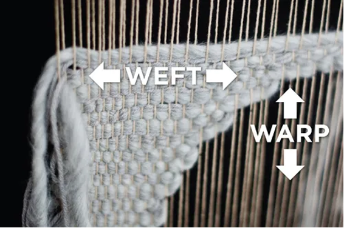

# CUDA Basics

This guide covers the fundamental concepts you'll use repeatedly in CUDA programming.

---

## Host vs Device

| Term | Hardware | Memory |
|------|----------|--------|
| **Host** | CPU | RAM (system memory) |
| **Device** | GPU | VRAM (video memory) |

### Naming Convention
```cpp
h_A  // Host variable (CPU)
d_A  // Device variable (GPU)
```

This convention makes it clear where your data lives.

---

## CUDA Program Flow

```
┌──────────────────────────────────────────────────────────────┐
│ 1. Allocate memory on GPU (cudaMalloc)                       │
│ 2. Copy input data from Host → Device (cudaMemcpy)           │
│ 3. Launch kernel (parallel execution on GPU)                 │
│ 4. Copy results from Device → Host (cudaMemcpy)              │
│ 5. Free GPU memory (cudaFree)                                │
└──────────────────────────────────────────────────────────────┘
```

---

## Function Qualifiers

CUDA extends C/C++ with special function qualifiers:

| Qualifier | Runs On | Called From | Returns |
|-----------|---------|-------------|---------|
| `__global__` | GPU | CPU (or GPU) | `void` only |
| `__device__` | GPU | GPU only | Any type |
| `__host__` | CPU | CPU only | Any type |

### `__global__` (Kernels)
The main entry point for GPU code. Called from CPU, executed by thousands of GPU threads.

```cpp
__global__ void addNumbers(int *a, int *b, int *result) {
    *result = *a + *b;
}
```

### `__device__`
Helper functions that run on GPU, callable only from other GPU code. Think of it as a library function for your kernels.

```cpp
__device__ float square(float x) {
    return x * x;
}

__global__ void compute(float *data) {
    int idx = threadIdx.x;
    data[idx] = square(data[idx]);  // Call device function
}
```

### `__host__`
Regular CPU function (same as omitting the qualifier). Can be combined with `__device__` to compile for both:

```cpp
__host__ __device__ float multiply(float a, float b) {
    return a * b;  // Works on both CPU and GPU
}
```

---

## CUDA Execution Hierarchy

```
Grid (entire kernel launch)
├── Block (0,0)
│   ├── Warp 0 (threads 0-31)
│   ├── Warp 1 (threads 32-63)
│   └── ... more warps
├── Block (1,0)
│   └── ... threads organized into warps
└── ... more blocks
```

### Thread
The smallest unit of execution. Each thread:
- Runs the kernel code independently
- Has a unique ID within its block
- Has private local memory (registers)

### Warp
- **32 threads** that execute in lockstep (SIMD)
- The actual unit of execution on hardware
- Instructions are issued to warps, not individual threads
- You can't avoid warps - they're fundamental to GPU architecture



### Block
A group of threads that can cooperate:
- Share memory (shared memory)
- Synchronize with each other
- Can be 1D, 2D, or 3D
- Maximum 1024 threads per block

### Grid
The entire set of threads for one kernel launch:
- Collection of blocks
- Can be 1D, 2D, or 3D
- Blocks execute independently (no guaranteed order)

**Why this hierarchy?**
- Blocks execute independently → Scalability across different GPUs
- Threads in a block can cooperate → Efficient data sharing
- Warps execute in lockstep → Hardware efficiency

---

## Thread Indexing

Every thread knows its position through built-in variables:

| Variable | Type | Description |
|----------|------|-------------|
| `threadIdx` | `dim3` | Thread's position within its block (x, y, z) |
| `blockIdx` | `dim3` | Block's position within the grid (x, y, z) |
| `blockDim` | `dim3` | Dimensions of each block (threads per block) |
| `gridDim` | `dim3` | Dimensions of the grid (blocks per grid) |

### Calculating Global Thread ID

For 1D arrays, the most common formula:

```cpp
int globalIdx = blockIdx.x * blockDim.x + threadIdx.x;
```

**Visual Example:**
```
Grid with 3 blocks, 4 threads each:

Block 0          Block 1          Block 2
[0][1][2][3]    [4][5][6][7]    [8][9][10][11]
 ↑               ↑
 threadIdx.x=0   threadIdx.x=0
 blockIdx.x=0    blockIdx.x=1
 global=0        global=4

For thread at blockIdx.x=1, threadIdx.x=2:
globalIdx = 1 * 4 + 2 = 6
```

### 2D Example

```cpp
int row = blockIdx.y * blockDim.y + threadIdx.y;
int col = blockIdx.x * blockDim.x + threadIdx.x;
int globalIdx = row * width + col;
```

---

## Launching Kernels

### The `<<<>>>` Syntax

```cpp
kernel<<<gridSize, blockSize>>>(arguments);
kernel<<<gridSize, blockSize, sharedMem, stream>>>(arguments);
```

### Using `dim3`

`dim3` specifies 3D dimensions (defaults to 1 for unspecified dimensions):

```cpp
dim3 blockSize(16, 16, 1);  // 16×16×1 = 256 threads per block
dim3 gridSize(8, 8, 1);     // 8×8×1 = 64 blocks

myKernel<<<gridSize, blockSize>>>(data);
```

### Calculating Grid Size

To cover an array of size N:

```cpp
int blockSize = 256;
int gridSize = (N + blockSize - 1) / blockSize;  // Ceiling division

myKernel<<<gridSize, blockSize>>>(data, N);
```

The `+ blockSize - 1` ensures we have enough threads even if N isn't divisible by blockSize.

---

## Memory Management

### cudaMalloc
Allocates memory on the GPU:

```cpp
float *d_array;
cudaMalloc(&d_array, N * sizeof(float));
```

### cudaMemcpy
Copies data between host and device:

```cpp
// Host → Device
cudaMemcpy(d_array, h_array, N * sizeof(float), cudaMemcpyHostToDevice);

// Device → Host
cudaMemcpy(h_array, d_array, N * sizeof(float), cudaMemcpyDeviceToHost);

// Device → Device
cudaMemcpy(d_dest, d_src, N * sizeof(float), cudaMemcpyDeviceToDevice);
```

### cudaFree
Releases GPU memory:

```cpp
cudaFree(d_array);
```

### cudaDeviceSynchronize
Forces CPU to wait until all GPU operations complete:

```cpp
myKernel<<<grid, block>>>(data);
cudaDeviceSynchronize();  // Wait for kernel to finish
// Now safe to use results
```

By default, kernel launches are asynchronous - CPU continues immediately. Use `cudaDeviceSynchronize()` when you need results before continuing.

---

## GPU Memory Types

| Memory | Speed | Size | Scope | Use Case |
|--------|-------|------|-------|----------|
| **Registers** | Fastest | Very small | Per thread | Local variables, loop counters |
| **Shared** | Very fast | Small (~48KB) | Per block | Data shared within a block |
| **Global** | Slow | Large (VRAM) | All threads | Main data arrays |
| **Constant** | Fast (cached) | Small (64KB) | All threads (read-only) | Constants, config params |
| **Local** | Slow | Per thread | Per thread | Register spills (avoid!) |

### Memory Hierarchy Diagram
```
┌─────────────────────────────────────────┐
│              GLOBAL MEMORY              │  ← Largest, slowest
│         (Accessible by all threads)     │
└─────────────────────────────────────────┘
         ↑                    ↑
    ┌────┴────┐          ┌────┴────┐
    │  Block  │          │  Block  │
    │ SHARED  │          │ SHARED  │      ← Fast, per-block
    │ MEMORY  │          │ MEMORY  │
    └────┬────┘          └────┬────┘
    ┌────┴────┐          ┌────┴────┐
    │REGISTERS│          │REGISTERS│      ← Fastest, per-thread
    └─────────┘          └─────────┘
```

---

## NVCC Compiler

NVCC (NVIDIA CUDA Compiler) handles both host and device code:

```
┌────────────────┐
│   .cu file     │
└───────┬────────┘
        │
        ▼
┌────────────────┐
│     NVCC       │
└───────┬────────┘
        │
   ┌────┴────┐
   ▼         ▼
┌──────┐  ┌──────┐
│ Host │  │Device│
│ Code │  │ Code │
└──┬───┘  └──┬───┘
   │         │
   ▼         ▼
┌──────┐  ┌──────┐
│ x86  │  │ PTX  │  ← Intermediate representation
│binary│  │      │
└──┬───┘  └──┬───┘
   │         │
   │         ▼
   │      ┌──────┐
   │      │ JIT  │  ← Just-In-Time compilation
   │      │      │    to native GPU instructions
   │      └──┬───┘
   │         │
   └────┬────┘
        ▼
┌────────────────┐
│  Executable    │
└────────────────┘
```

**PTX (Parallel Thread Execution):**
- Intermediate representation for device code
- Stable across GPU generations
- JIT-compiled to native instructions at runtime
- Enables forward compatibility

---

## Complete Example

Here's everything put together - adding two arrays:

```cpp
#include <stdio.h>

// Kernel definition
__global__ void addArrays(int *a, int *b, int *c, int size) {
    // Calculate unique global index
    int idx = blockIdx.x * blockDim.x + threadIdx.x;

    // Bounds check (important!)
    if (idx < size) {
        c[idx] = a[idx] + b[idx];
    }
}

int main() {
    int N = 1000;
    size_t bytes = N * sizeof(int);

    // Host arrays
    int *h_a = (int*)malloc(bytes);
    int *h_b = (int*)malloc(bytes);
    int *h_c = (int*)malloc(bytes);

    // Initialize host data
    for (int i = 0; i < N; i++) {
        h_a[i] = i;
        h_b[i] = i * 2;
    }

    // Device arrays
    int *d_a, *d_b, *d_c;
    cudaMalloc(&d_a, bytes);
    cudaMalloc(&d_b, bytes);
    cudaMalloc(&d_c, bytes);

    // Copy to device
    cudaMemcpy(d_a, h_a, bytes, cudaMemcpyHostToDevice);
    cudaMemcpy(d_b, h_b, bytes, cudaMemcpyHostToDevice);

    // Launch kernel
    int blockSize = 256;
    int gridSize = (N + blockSize - 1) / blockSize;
    addArrays<<<gridSize, blockSize>>>(d_a, d_b, d_c, N);

    // Copy results back
    cudaMemcpy(h_c, d_c, bytes, cudaMemcpyDeviceToHost);

    // Verify
    printf("Results: %d + %d = %d\n", h_a[0], h_b[0], h_c[0]);
    printf("         %d + %d = %d\n", h_a[N-1], h_b[N-1], h_c[N-1]);

    // Cleanup
    cudaFree(d_a);
    cudaFree(d_b);
    cudaFree(d_c);
    free(h_a);
    free(h_b);
    free(h_c);

    return 0;
}
```

---

## Quick Reference

```cpp
// Function qualifiers
__global__ void kernel();    // GPU, called from CPU
__device__ void helper();    // GPU, called from GPU
__host__ void cpuFunc();     // CPU only

// Thread indexing
int idx = blockIdx.x * blockDim.x + threadIdx.x;

// Memory management
cudaMalloc(&d_ptr, size);
cudaMemcpy(dst, src, size, cudaMemcpyHostToDevice);
cudaMemcpy(dst, src, size, cudaMemcpyDeviceToHost);
cudaFree(d_ptr);
cudaDeviceSynchronize();

// Kernel launch
dim3 block(256);
dim3 grid((N + 255) / 256);
kernel<<<grid, block>>>(args);
```

---

## Key Takeaways

1. **Host = CPU, Device = GPU** - Data must be explicitly copied between them
2. **`__global__` kernels** are your entry point to GPU execution
3. **Threads → Warps → Blocks → Grid** - The execution hierarchy
4. **Always bounds check** - You often launch more threads than needed
5. **Memory matters** - Use shared memory for speed, global for capacity
6. **Blocks are independent** - They can execute in any order
