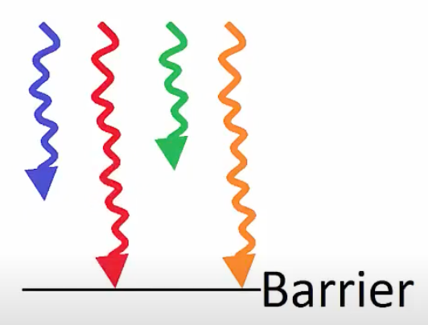

# CUDA Kernel Concepts

This document covers essential concepts for writing and launching CUDA kernels:
kernel configuration, thread synchronization, thread safety, and SIMT execution.

---

## 1. Kernel Launch Configuration

### The `<<<grid, block>>>` Syntax

Every kernel launch requires specifying how many threads to create:

```cpp
myKernel<<<gridDim, blockDim>>>(args...);
```

The full syntax is:

```cpp
<<<gridDim, blockDim, sharedMemBytes, stream>>>
```

| Parameter | Type | Description |
|-----------|------|-------------|
| `gridDim` | `dim3` or `int` | Number of blocks in the grid (x, y, z) |
| `blockDim` | `dim3` or `int` | Number of threads per block (x, y, z) |
| `sharedMemBytes` | `size_t` | Dynamic shared memory per block (optional, default 0) |
| `stream` | `cudaStream_t` | CUDA stream for async execution (optional, default 0) |

### The `dim3` Type

`dim3` is a 3-component vector for specifying grid and block dimensions:

```cpp
dim3 gridDim(4, 4, 1);   // 4×4×1 = 16 blocks
dim3 blockDim(4, 2, 2);  // 4×2×2 = 16 threads per block
                         // Total: 16 × 16 = 256 threads
```

For 1D problems, you can use plain integers:

```cpp
int numBlocks = 16;
int threadsPerBlock = 256;
myKernel<<<numBlocks, threadsPerBlock>>>(args...);
// Total: 16 × 256 = 4,096 threads
```

### Calculating Total Threads

```
Total blocks  = gridDim.x × gridDim.y × gridDim.z
Threads/block = blockDim.x × blockDim.y × blockDim.z
Total threads = Total blocks × Threads/block
```

### Hardware Limits

| Constraint | Limit |
|------------|-------|
| Max threads per block | 1024 |
| Max block dimensions | (1024, 1024, 64) |
| Max grid dimensions | (2³¹-1, 65535, 65535) |
| Threads per warp | 32 |
| Max warps per block | 32 (since 32 × 32 = 1024) |

---

## 2. Thread Synchronization

### Why Synchronize?

Threads execute asynchronously and in arbitrary order. When threads depend on
each other's results, synchronization prevents race conditions.

**Example problem:** Add arrays `a + b → c`, then add 1 to each element of `c`.

```
Without sync:
  Thread 0: c[0] = a[0] + b[0]     → c[0] = 6
  Thread 0: c[0] = c[0] + 1       → c[0] = 7  ✓

  Thread 1: c[1] = c[1] + 1       → c[1] = 1  ✗ (c[1] wasn't set yet!)
  Thread 1: c[1] = a[1] + b[1]    → c[1] = 8  ✗ (overwrites the +1)
```

### Synchronization Functions

| Function | Scope | Called From | Purpose |
|----------|-------|-------------|---------|
| `cudaDeviceSynchronize()` | All threads on device | Host (CPU) | Wait for all GPU work to finish |
| `__syncthreads()` | All threads in block | Device (kernel) | Barrier within a block |
| `__syncwarp()` | 32 threads in warp | Device (kernel) | Barrier within a warp |

### `cudaDeviceSynchronize()`

Called from host code. Blocks the CPU until all GPU kernels complete.

```cpp
kernel1<<<grid, block>>>(data);
cudaDeviceSynchronize();  // Wait for kernel1 to finish
kernel2<<<grid, block>>>(data);  // Safe to use kernel1's results
```

**When to use:**
- Before reading GPU results back to CPU
- Between dependent kernel launches
- For timing measurements (kernels are async!)

### `__syncthreads()`

Called from inside a kernel. All threads in the block must reach this point
before any can proceed.

```cpp
__global__ void sharedMemExample(float *data) {
    __shared__ float sharedData[256];

    // All threads load data into shared memory
    sharedData[threadIdx.x] = data[blockIdx.x * blockDim.x + threadIdx.x];

    __syncthreads();  // BARRIER: Wait for all loads to complete

    // Now safe to read any element of sharedData
    float neighbor = sharedData[(threadIdx.x + 1) % blockDim.x];
}
```

**Critical rules:**
- ALL threads in the block must reach the same `__syncthreads()`
- Never put `__syncthreads()` inside a conditional where some threads skip it
- Only synchronizes within ONE block (not across blocks)

```cpp
// WRONG - undefined behavior!
if (threadIdx.x < 128) {
    __syncthreads();  // Only half the threads reach this!
}

// CORRECT
__syncthreads();
if (threadIdx.x < 128) {
    // Do conditional work after sync
}
```

### `__syncwarp()`

Synchronizes all 32 threads within a single warp. Lighter weight than
`__syncthreads()` when you only need intra-warp synchronization.

```cpp
__global__ void warpExample() {
    // Warp-level reduction
    int val = threadIdx.x;
    val += __shfl_down_sync(0xffffffff, val, 16);
    val += __shfl_down_sync(0xffffffff, val, 8);
    val += __shfl_down_sync(0xffffffff, val, 4);
    val += __shfl_down_sync(0xffffffff, val, 2);
    val += __shfl_down_sync(0xffffffff, val, 1);
    __syncwarp();  // Ensure warp is synchronized
}
```

### Visual: Barrier Synchronization

```
Threads executing over time →

Thread 0: ████░░░░░░░░████████
Thread 1: ████████░░░░████████
Thread 2: ██░░░░░░░░░░████████
Thread 3: ██████████░░████████
                    ↑
              __syncthreads()

All threads wait at the barrier until the slowest one arrives.
```



---

## 3. Thread Safety and Race Conditions

### What is Thread Safety?

Code is "thread-safe" when multiple threads can execute it simultaneously
without causing incorrect results or undefined behavior.

### Race Conditions

A race condition occurs when the result depends on the unpredictable order
of thread execution.

```cpp
// RACE CONDITION - undefined result!
__global__ void raceExample(int *counter) {
    *counter = *counter + 1;  // Multiple threads read-modify-write
}
```

What can happen with 4 threads:
```
Thread 0: read counter (0) → add 1 → write (1)
Thread 1: read counter (0) → add 1 → write (1)  // Lost update!
Thread 2: read counter (1) → add 1 → write (2)
Thread 3: read counter (1) → add 1 → write (2)  // Lost update!

Expected: 4, Actual: 2
```

### Solutions to Race Conditions

1. **Atomic operations** - Hardware-guaranteed read-modify-write

```cpp
__global__ void atomicExample(int *counter) {
    atomicAdd(counter, 1);  // Thread-safe increment
}
```

2. **Synchronization barriers** - Coordinate thread execution

```cpp
__global__ void syncExample(int *data) {
    data[threadIdx.x] = threadIdx.x;
    __syncthreads();  // All writes complete before reads
    int neighbor = data[(threadIdx.x + 1) % blockDim.x];
}
```

3. **Separate read/write locations** - Avoid conflicts entirely

```cpp
__global__ void noConflict(int *input, int *output) {
    // Each thread reads its own input, writes its own output
    output[threadIdx.x] = input[threadIdx.x] * 2;
}
```

### Thread Safety of CUDA API

The CUDA runtime API is thread-safe: you can call CUDA functions from
multiple CPU threads simultaneously. Each CPU thread can manage its own
GPU operations or share a GPU context.

> Reference: [NVIDIA Forums - Is CUDA thread-safe?](https://forums.developer.nvidia.com/t/is-cuda-thread-safe/2262/2)

---

## 4. SIMT: Single Instruction, Multiple Threads

### How GPU Execution Differs from CPU

| Aspect | CPU (SIMD) | GPU (SIMT) |
|--------|------------|------------|
| Unit of execution | Core executes 1 thread | SM executes 1 warp (32 threads) |
| Instruction | Same instruction on vector lanes | Same instruction on all threads in warp |
| Control flow | Branch prediction | All threads must agree or diverge |
| Design philosophy | Complex cores, few threads | Simple cores, many threads |

### Why SIMT is Simpler

GPUs trade per-thread complexity for massive parallelism:

- **In-order execution** - No out-of-order speculation
- **No branch prediction** - Execute both paths if threads diverge
- **No complex caches** - More die area for compute units
- **Hardware scheduling** - Warps scheduled by hardware, not software

This simplicity allows thousands of threads on a single chip.

### Warp Execution

All 32 threads in a warp execute the same instruction simultaneously:

```cpp
__global__ void warpExample(int *data) {
    int tid = threadIdx.x;
    data[tid] = tid * 2;  // All 32 threads in warp execute this together
}
```

If threads diverge (different branches), the warp executes each path
sequentially, masking inactive threads:

```cpp
if (threadIdx.x < 16) {
    // First 16 threads active, others masked (waiting)
    doSomething();
} else {
    // Last 16 threads active, first 16 masked (waiting)
    doSomethingElse();
}
// Both paths complete, warp reconverges
```

### Hardware Constraints

From the [CUDA Programming Guide](https://docs.nvidia.com/cuda/cuda-c-programming-guide/index.html#thread-hierarchy):

> "All threads of a block are expected to reside on the same streaming
> multiprocessor core and must share the limited memory resources of that
> core. On current GPUs, a thread block may contain up to 1024 threads."

- 1024 threads per block maximum
- 32 threads per warp
- 32 warps per block maximum

### Warp-Level Primitives

For advanced optimizations, CUDA provides warp-level operations:

```cpp
// Shuffle: exchange data between warp threads without shared memory
int value = __shfl_sync(0xffffffff, srcValue, srcLane);

// Vote: collective decision making
bool allTrue = __all_sync(0xffffffff, condition);
bool anyTrue = __any_sync(0xffffffff, condition);

// Ballot: gather predicate bits from all threads
unsigned mask = __ballot_sync(0xffffffff, condition);
```

> Deep dive: [Using CUDA Warp-Level Primitives](https://developer.nvidia.com/blog/using-cuda-warp-level-primitives/)

---

## 5. Math Intrinsics

### Device-Optimized Math Functions

CUDA provides hardware-accelerated math functions that run directly on
GPU special function units (SFUs):

| Standard (slower) | Intrinsic (faster) | Notes |
|-------------------|-------------------|-------|
| `sinf(x)` | `__sinf(x)` | ~2 ULP error |
| `cosf(x)` | `__cosf(x)` | ~2 ULP error |
| `expf(x)` | `__expf(x)` | ~2 ULP error |
| `logf(x)` | `__logf(x)` | ~1 ULP error |
| `sqrtf(x)` | `__fsqrt_rn(x)` | IEEE compliant |
| `1.0f/x` | `__frcp_rn(x)` | Fast reciprocal |
| `1.0f/sqrtf(x)` | `__frsqrt_rn(x)` | Fast inverse sqrt |

ULP = Units in Last Place (measure of floating-point error)

### Compiler Flags

```bash
# Convert all math to fast intrinsics (slight precision loss)
nvcc --use_fast_math mykernel.cu

# Enable fused multiply-add (a*b+c in one instruction)
nvcc --fmad=true mykernel.cu
```

`--use_fast_math` enables:
- `--ftz=true` (flush denormals to zero)
- `--prec-div=false` (fast division)
- `--prec-sqrt=false` (fast square root)
- `--fmad=true` (fused multiply-add)

### When to Use Intrinsics

- **Use intrinsics:** Graphics, games, neural networks (speed > precision)
- **Use standard:** Scientific computing, finance (precision critical)

> Full list: [CUDA Math API](https://docs.nvidia.com/cuda/cuda-math-api/index.html)

---

## Files in This Folder

| File | Description |
|------|-------------|
| `01_vector_add_v1.cu` | Basic CPU vs GPU vector addition benchmark |
| `02_vector_add_v2.cu` | 1D vs 3D grid comparison for vector addition |
| `03_matmul.cu` | Naive matrix multiplication (CPU vs GPU) |

---

## Quick Reference

```cpp
// Kernel launch
myKernel<<<numBlocks, threadsPerBlock>>>(args);
myKernel<<<grid3D, block3D, sharedMem, stream>>>(args);

// Synchronization
cudaDeviceSynchronize();   // Host: wait for all GPU work
__syncthreads();           // Device: barrier within block
__syncwarp();              // Device: barrier within warp

// Atomics (thread-safe operations)
atomicAdd(&var, value);
atomicMax(&var, value);
atomicCAS(&var, compare, value);

// Built-in variables (read-only in kernels)
threadIdx.x, threadIdx.y, threadIdx.z   // Thread position in block
blockIdx.x, blockIdx.y, blockIdx.z      // Block position in grid
blockDim.x, blockDim.y, blockDim.z      // Block dimensions
gridDim.x, gridDim.y, gridDim.z         // Grid dimensions
warpSize                                 // Always 32
```
