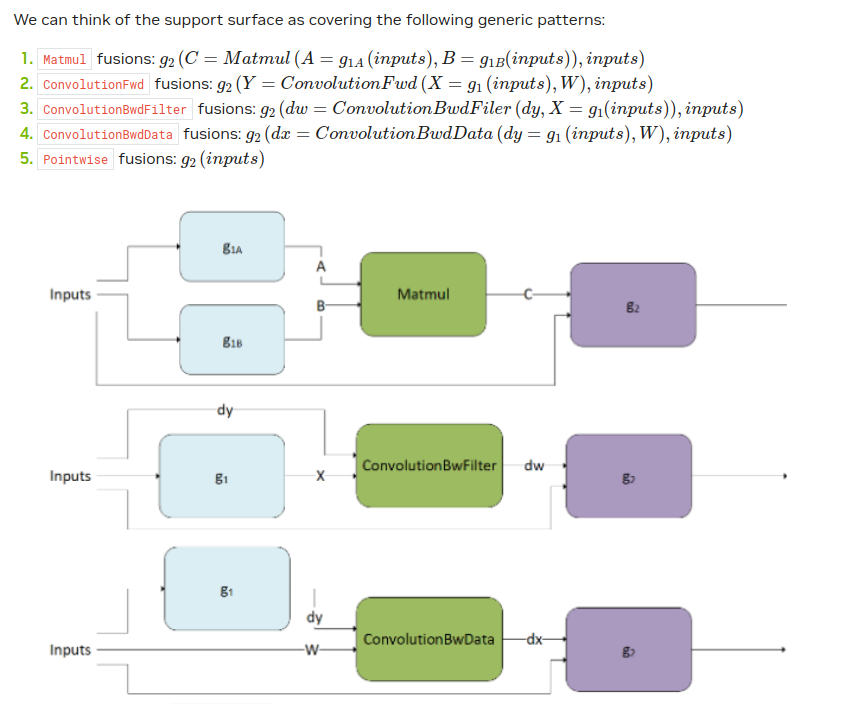
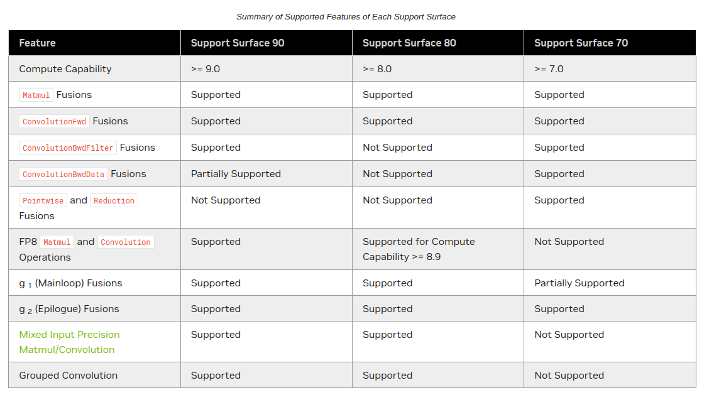

# cuDNN - CUDA Deep Neural Network Library

NVIDIA cuDNN provides highly tuned GPU implementations of operations that arise
frequently in deep learning. Every major framework (PyTorch, TensorFlow, JAX)
uses cuDNN under the hood.

> You technically don't need cuFFT or a ton of manually written custom kernels
> to write a GPT training run + inference. Fast convolution is built into cuDNN,
> and cuBLAS matmul is included in cuDNN at a greater abstraction. Still a good
> idea to review the idea of slow conv vs fast conv, slow matmul vs fast matmul.


## What cuDNN Provides

- **Convolution** forward and backward (including cross-correlation)
- **GEMM** (general matrix multiply) - wraps cuBLAS at higher abstraction
- **Pooling** forward and backward
- **Softmax** forward and backward
- **Activations** forward and backward: ReLU, Tanh, Sigmoid, ELU, GELU, Softplus, Swish
- **Pointwise operations** (arithmetic, mathematical, relational, logical)
- **Tensor transformations** (reshape, transpose, concat, etc.)
- **Normalization** forward and backward: BatchNorm, InstanceNorm, LayerNorm, LRN, LCN
- **RNNs** (LSTM, GRU), CTC loss, multi-head attention

Beyond individual operations, cuDNN supports **operation fusion** - combining
multiple operations into a single kernel for better performance.

---

## Legacy API vs Graph API

### Legacy API (cuDNN 7 and older)

The legacy API provides a **fixed set of operations** with predetermined function calls.
You describe inputs with tensor descriptors, then call a specific function like
`cudnnConvolutionForward`. Simple but inflexible - you can only use the combinations
NVIDIA pre-built.

### Graph API (cuDNN 8+)

Starting in cuDNN 8, the **Graph API** lets you express computation as an
**operation graph** where:
- **Nodes** = operations (convolution, matmul, activation, etc.)
- **Edges** = tensors flowing between operations

This is the **recommended way** to use cuDNN for most use cases.

> You may initially confuse "Graph API" with graph neural networks. It has
> nothing to do with GNNs. It just means you define your operations as a graph
> (a DAG of computations). Rather than using fixed operations from the legacy API
> (which you can't see inside since it's a precompiled binary), the Graph API
> gives you a composable interface to build operation patterns without changing
> the low-level source code.

**cuDNN API categories:**

| API | Purpose |
|-----|---------|
| **Graph API** | Kernel fusion via operation graphs (nodes = ops, edges = tensors) |
| **Ops API** | Single operation engines (softmax, batchnorm, dropout, etc.) |
| **CNN API** | Convolution and related operations (depended on by Graph API) |
| **Adv API** | "Other" features (RNNs, CTC loss, multihead attention, etc.) |

---

## Descriptor-Based Pattern

cuDNN uses **opaque descriptor types** (just like cuBLAS handles). You create
descriptors that describe your tensors, operations, and filters, then pass them
to cuDNN functions. cuDNN uses this information to pick the fastest algorithm.

### Key Descriptor Types

```
cudnnHandle_t                    - Library context (create → use → destroy)
cudnnTensorDescriptor_t          - Describes a tensor (shape, layout, dtype)
cudnnFilterDescriptor_t          - Describes a convolution filter/kernel
cudnnConvolutionDescriptor_t     - Describes a convolution operation (padding, stride)
cudnnConvolutionFwdAlgo_t        - Algorithm selection for forward convolution
```

### How Tensor Descriptors Work

When you allocate memory for a tensor, it's just a flat array of floats.
cuDNN needs to know the **shape and layout** to interpret it correctly.

Example - a PyTorch tensor with shape (4, 2, 3):

```python
tensor([[[-1.7182,  1.2014, -0.0144],
         [-0.6332, -0.5842, -0.7202]],

        [[ 0.6992, -0.9595,  0.1304],
         [-0.0369,  0.8105,  0.8588]],

        [[-1.0553,  1.9859,  0.9880],
         [ 0.6508,  1.4037,  0.0909]],

        [[-0.6083,  0.4942,  1.9186],
         [-0.7630, -0.8169,  0.6805]]])
```

In GPU memory, this is just a flat array:

```
[-1.7182, 1.2014, -0.0144, -0.6332, -0.5842, -0.7202, 0.6992, -0.9595,
  0.1304, -0.0369, 0.8105, 0.8588, -1.0553, 1.9859, 0.9880, 0.6508,
  1.4037, 0.0909, -0.6083, 0.4942, 1.9186, -0.7630, -0.8169, 0.6805]
```

cuDNN reconstructs the structure from the shape you provide:
- Split into 4 equal sections → batch elements (N=4)
- Split each into 2 sections → channels (C=2)
- Each section has 3 values → width (W=3)

As long as you specify the shape properly (e.g. `NCHW`: batch, channels, height,
width), cuDNN interprets the flat array correctly.

### Tensor Layouts

| Layout | Order | Used By |
|--------|-------|---------|
| `NCHW` | Batch, Channels, Height, Width | PyTorch default |
| `NHWC` | Batch, Height, Width, Channels | TensorFlow default, faster on Tensor Cores |

---

## Convolution Forward - Walkthrough

The complete workflow for `cudnnConvolutionForward`:

```cpp
// Function signature (13 parameters):
cudnnConvolutionForward(
    cudnnHandle_t handle,                        // Library context
    const void *alpha,                           // Scale factor for output (usually 1.0)
    const cudnnTensorDescriptor_t xDesc,         // Input tensor descriptor
    const void *x,                               // Input tensor (device memory)
    const cudnnFilterDescriptor_t wDesc,         // Filter/kernel descriptor
    const void *w,                               // Filter weights (device memory)
    const cudnnConvolutionDescriptor_t convDesc,  // Convolution parameters (padding, stride)
    cudnnConvolutionFwdAlgo_t algo,               // Which algorithm to use
    void *workSpace,                              // Temporary GPU memory for the algorithm
    size_t workSpaceSizeInBytes,                  // Size of workspace
    const void *beta,                            // Scale factor for existing output (usually 0.0)
    const cudnnTensorDescriptor_t yDesc,         // Output tensor descriptor
    void *y                                      // Output tensor (device memory)
);
```

**Workflow:**

```
1. cudnnCreate(&handle)                          // Create context
2. Create descriptors:
   - cudnnCreateTensorDescriptor(&inputDesc)     // Input tensor
   - cudnnCreateFilterDescriptor(&filterDesc)    // Conv filter
   - cudnnCreateConvolutionDescriptor(&convDesc) // Conv operation
   - cudnnCreateTensorDescriptor(&outputDesc)    // Output tensor
3. Set descriptor values:
   - cudnnSetTensor4dDescriptor(inputDesc, NCHW, FLOAT, N, C, H, W)
   - cudnnSetFilter4dDescriptor(filterDesc, ...)
   - cudnnSetConvolution2dDescriptor(convDesc, pad, pad, stride, stride, ...)
4. Find fastest algorithm:
   - cudnnGetConvolutionForwardAlgorithm_v7(...)
5. Allocate workspace:
   - cudnnGetConvolutionForwardWorkspaceSize(...)
   - cudaMalloc(&workspace, workspaceSize)
6. Execute:
   - cudnnConvolutionForward(handle, &alpha, inputDesc, d_input,
         filterDesc, d_filter, convDesc, algo, workspace, workspaceSize,
         &beta, outputDesc, d_output)
7. Cleanup:
   - Destroy descriptors → destroy handle
```

**Why so many steps?** cuDNN needs all this information to pick the fastest
algorithm. Different tensor sizes, data types, and GPU architectures benefit
from completely different strategies.

---

## Algorithm Selection

cuDNN offers multiple algorithms for the same operation. Different algorithms
have different speed/memory tradeoffs:

| Algorithm | Best For | Memory Usage |
|-----------|----------|--------------|
| `IMPLICIT_GEMM` | Small inputs | Low |
| `IMPLICIT_PRECOMP_GEMM` | General purpose | Medium |
| `GEMM` | Large inputs | High (needs workspace) |
| `WINOGRAD` | 3x3 filters specifically | Medium |
| `FFT` | Large filters | High |

You can let cuDNN benchmark and auto-select the fastest one.
In PyTorch, this is what `torch.backends.cudnn.benchmark = True` does -
it tries all algorithms on the first run and caches the fastest one.

Sometimes you can get better performance by writing your own kernel instead of
relying on cuDNN. You can also implement your own operation graph and fuse
operations together, resulting in speedups for certain parts of the fwd/bkwd pass.

---

## Engine Types

cuDNN uses different "engines" to execute operations. Understanding these
helps you reason about performance:

### 1. Pre-compiled Single Operation Engines
Pre-compiled and optimized for one specific operation. Very fast but inflexible.

*Example: A matmul engine optimized specifically for that one operation.*

### 2. Generic Runtime Fusion Engines
Dynamically fuse multiple operations at runtime. More flexible than pre-compiled
but not as highly optimized.

*Example: An engine that dynamically fuses element-wise operations to avoid
redundant memory reads/writes. You can fuse uncommon operation combos,
gaining decent improvement, but still not as fast as pre-compiled.*

### 3. Specialized Runtime Fusion Engines
Like generic runtime fusion, but optimized for known patterns. Recognizes
common operation sequences during compilation and finds optimized fused
implementations in the backend.

*Example: An engine optimized for fusing convolution → activation. It
recognizes the pattern and maps it to a pre-optimized fused kernel.*

### 4. Specialized Pre-compiled Fusion Engines
Pre-compiled and optimized for specific operation sequences. Same high
performance as pre-compiled single ops, but handles multiple operations.

*Example: A pre-compiled engine for a conv → batchnorm → ReLU block
that runs the entire sequence in a single kernel launch.*

---

## Kernel Fusion (Graph API)

The Graph API enables kernel fusion where multiple operations are combined
into a single kernel launch, avoiding redundant global memory reads/writes.

### Runtime Fusion Example

Without fusion - each operation is a separate kernel launch:
```python
# 3 kernel launches, 3 reads from global memory, 3 writes to global memory
temp1 = tensor2 * tensor3        # Kernel 1: read 2 tensors, write 1
temp2 = tensor1 + temp1          # Kernel 2: read 2 tensors, write 1
output = torch.sigmoid(temp2)    # Kernel 3: read 1 tensor, write 1
```

With runtime fusion - combined into a single kernel:
```python
# 1 kernel launch, intermediate results stay in registers
output = torch.sigmoid(tensor1 + tensor2 * tensor3)
```

### Supported Fusion Patterns

The cuDNN runtime fusion engine supports these generic patterns:

1. **Matmul fusions**: g2(C = Matmul(A = g1A(inputs), B = g1B(inputs)), inputs)
2. **ConvolutionFwd fusions**: g2(Y = ConvFwd(X = g1(inputs), W), inputs)
3. **ConvolutionBwdFilter fusions**: g2(dw = ConvBwdFilter(dy, X = g1(inputs)), inputs)
4. **ConvolutionBwdData fusions**: g2(dx = ConvBwdData(dy = g1(inputs), W), inputs)
5. **Pointwise fusions**: g2(inputs)

Where:
- **g1** = mainloop pre-processing (applied to inputs before the main operation)
- **g2** = epilogue post-processing (applied to outputs after the main operation)



### Compute Capability Support

Not all fusion patterns work on all GPUs. Check your GPU's compute capability:
- RTX 4070 = Compute Capability 8.9 (Ada Lovelace)
- RTX 3090 = Compute Capability 8.6 (Ampere)
- V100 = Compute Capability 7.0 (Volta)



---

## Performance Benchmarking Tips

- **Algorithm benchmarking**: Try different `cudnnConvolutionFwdAlgo_t` values
  (e.g. `CUDNN_CONVOLUTION_FWD_ALGO_IMPLICIT_GEMM`) and compare performance
  for your specific input sizes
- **Custom kernels can win**: For specific use cases (non-batch, unusual shapes),
  a hand-written kernel can beat cuDNN
- **Graph API fusions**: Implement your own operation graph to fuse operations,
  gaining speedups for certain chunks of the forward/backward pass
- **`torch.backends.cudnn.benchmark = True`**: In PyTorch, this auto-benchmarks
  cuDNN algorithms on first run and caches the fastest one

---

## Navigating the cuDNN Documentation

The cuDNN docs are large. Here's how to navigate them:

1. **Ctrl+click** function names in your IDE to see signatures
2. **Google**: `site:docs.nvidia.com cudnnConvolutionForward` for specific functions
3. **Graph API docs**: https://docs.nvidia.com/deeplearning/cudnn/latest/developer/graph-api.html
4. **Full API reference**: https://docs.nvidia.com/deeplearning/cudnn/latest/api/

For the algorithm types, look at the top of:
https://docs.nvidia.com/deeplearning/cudnn/latest/api/cudnn-ops-library.html

---

## Compiling with cuDNN

```bash
nvcc program.cu -o program.exe -lcudnn
```

---

## Folder Contents

| File | Description |
|------|-------------|
| `README.md` | This guide |
| `01_tanh.cu` | cuDNN activation (tanh) vs naive CUDA kernel benchmark |
| `02_compare_tanh.py` | PyTorch built-in tanh (cuDNN) vs custom tanh formula |
| `knlfusion1.png` | Runtime fusion patterns diagram (g1/g2 structure) |
| `knlfusion2.png` | Compute capability support table for fusion patterns |
