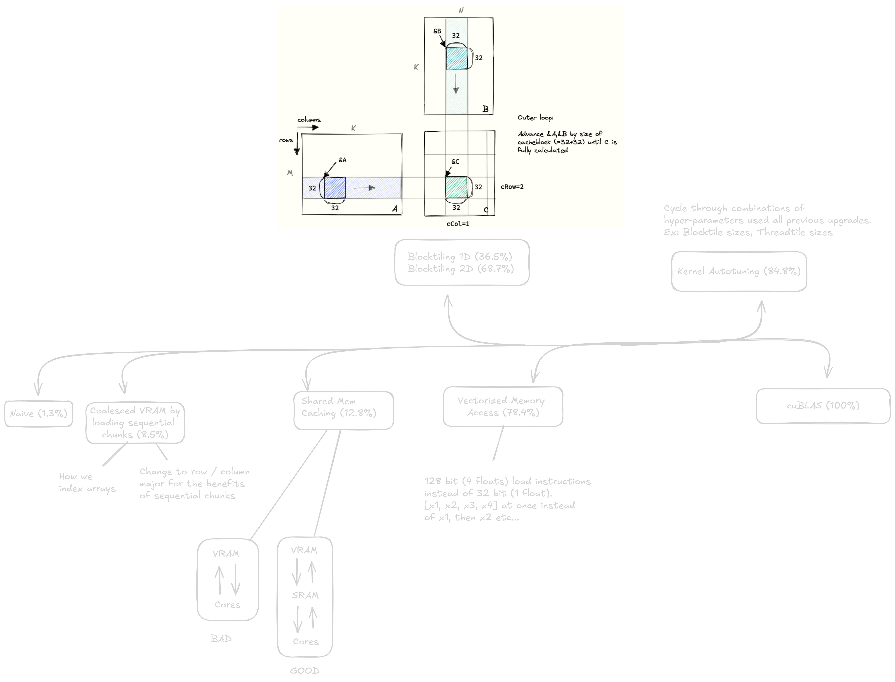

# Optimizing Matrix Multiplication (SGEMM)

This folder explores progressive optimizations for matrix multiplication kernels, from a naive baseline to cuBLAS-level performance.



## Optimization Techniques (Overview)

This is a reference guide. For full implementations and detailed explanations, see the resources at the bottom.

| Optimization | Description |
|--------------|-------------|
| **Naive** | Simplest implementation — one thread per output element, direct global memory access |
| **Coalesced Memory Access** | Ensure adjacent threads access adjacent memory locations (128-byte cache line utilization) |
| **Shared Memory Tiling** | Cache tiles of A and B in on-chip shared memory to reduce global memory bandwidth |
| **1D/2D Block Tiling** | Partition work across SMs for better occupancy and load balancing |
| **Vectorized Memory Access** | Load 128 bits (4 floats) per instruction instead of 32 bits (1 float) |
| **Autotuning** | Grid search over tile sizes, block dimensions, and unroll factors for your specific GPU |
| **cuBLAS** | NVIDIA's highly optimized closed-source library (baseline for comparison) |

Each optimization builds on the previous one, typically adding 20-50% speedup per step. A fully optimized kernel can reach **80-95% of cuBLAS performance**.

---

## Row-Major vs Column-Major Storage

This is critical for understanding cuBLAS and BLAS libraries in general.

**Row-Major** (C, CUDA default):
Rows are stored contiguously. Element `A[i][j]` is at index `i * N + j`.

```
Matrix:         Memory layout:
[ 1  2  3 ]     [1, 2, 3,  4, 5, 6,  7, 8, 9]
[ 4  5  6 ]      └─row 0─┘ └─row 1─┘ └─row 2─┘
[ 7  8  9 ]
```

**Column-Major** (Fortran, cuBLAS, MATLAB):
Columns are stored contiguously. Element `A[i][j]` is at index `j * M + i`.

```
SAME matrix:    Memory layout:
[ 1  2  3 ]     [1, 4, 7,  2, 5, 8,  3, 6, 9]
[ 4  5  6 ]      └─col 0─┘ └─col 1─┘ └─col 2─┘
[ 7  8  9 ]
```

**Why does cuBLAS use column-major?**
Historical compatibility with Fortran BLAS libraries. To use cuBLAS with row-major matrices, you have two options:

1. **Transpose** the matrices before calling cuBLAS (slow — extra memory copies)
2. **Swap the operands**: Compute `B * A` instead of `A * B` to exploit the identity:
   `(A * B)^T = B^T * A^T`
   Since transposing row-major → column-major is a no-op (just reinterpret the layout), this avoids explicit transposes.

---

## `#pragma unroll` Directive

**What it does:**
Tells the compiler to unroll a loop — replace iterations with repeated code.

**Example:**
```cuda
// Original loop
#pragma unroll
for (int i = 0; i < 4; ++i) {
    sum += a[i] * b[i];
}

// Compiler generates this:
sum += a[0] * b[0];
sum += a[1] * b[1];
sum += a[2] * b[2];
sum += a[3] * b[3];
```

**Benefits:**
- Reduces loop overhead (fewer branch instructions)
- Exposes instruction-level parallelism (ILP) — GPU can issue multiple operations per cycle
- Enables more aggressive compiler optimizations

**When to use:**
- Small, fixed-iteration loops (e.g., tile dimensions)
- Inner loops where each iteration is independent

**Does the compiler auto-unroll?**
Sometimes. Check the PTX assembly to verify:
```bash
nvcc -ptx kernel.cu -o - | less
```
Look for repeated instructions instead of loop control flow (`bra`, `setp`).

**Benchmarking unrolling:**
Write two versions (with/without `#pragma unroll`), time them, and verify correctness. If performance is identical, the compiler already unrolled it automatically.

---

## Occupancy

**Definition:**
Occupancy = (active warps per SM) / (maximum warps per SM)

Higher occupancy → better latency hiding (while one warp waits for memory, others compute).

**Limits to occupancy:**

| Resource | Limit (example: A100) |
|----------|------------------------|
| Registers per SM | 65,536 |
| Shared memory per SM | 164 KB (configurable) |
| Warps per SM | 64 max |
| Threads per block | 1024 max |

If your kernel uses too many registers or shared memory, fewer blocks fit on each SM → lower occupancy.

**Tools:**
- `nvcc --ptxas-options=-v` — prints register/smem usage
- `nsys profile` — reports achieved occupancy
- [CUDA Occupancy Calculator](https://docs.nvidia.com/cuda/cuda-occupancy-calculator/index.html)

**Trade-off:**
100% occupancy ≠ best performance. Sometimes using more registers per thread (lower occupancy) enables better optimizations. **Always benchmark.**

Further reading: [CUDA Best Practices Guide - Occupancy](https://docs.nvidia.com/cuda/cuda-c-best-practices-guide/index.html#occupancy)

---

## Assembly Deep Dive

### Why Read/Write Assembly?

1. **Understand bottlenecks** — See exactly where warps stall (memory waits, warp divergence, expensive ops)
2. **Clock-cycle optimization** — Closest to bare metal; critical for libraries like cuBLAS/cuDNN
3. **Verify compiler output** — Check if `#pragma unroll` worked, if loads are vectorized, etc.

### PTX vs SASS

| Assembly | Level | Description |
|----------|-------|-------------|
| **PTX** (Parallel Thread Execution) | Virtual ISA | High-level, architecture-independent intermediate representation |
| **SASS** (Shader Assembly) | Native ISA | Low-level, GPU-specific machine code (what actually runs) |

Generate PTX:
```bash
nvcc -ptx kernel.cu -o kernel.ptx
```

Generate SASS (requires `cuobjdump` or `nvdisasm`):
```bash
nvcc kernel.cu -o kernel
cuobjdump -sass kernel
```

### Resources

- [PTX ISA Reference](https://docs.nvidia.com/cuda/parallel-thread-execution/index.html) — Official instruction set documentation
- [How to Read SASS](https://interplayoflight.wordpress.com/2021/04/18/how-to-read-shader-assembly/) — Practical guide with examples

---

## References & Further Reading

This folder is a **reference guide** to matmul optimizations. For complete implementations, see:

### Core Resources (Implementations)

1. **[Simon Boehm (Anthropic) — CUDA SGEMM](https://siboehm.com/articles/22/CUDA-MMM)**
   Step-by-step blog post with benchmarks. [GitHub repo](https://github.com/siboehm/SGEMM_CUDA)

2. **[Lei Mao (NVIDIA) — GEMM Optimizations](https://github.com/leimao/CUDA-GEMM-Optimization)**
   Multiple optimization stages with detailed comments

### Advanced: cuTLASS

To understand how NVIDIA achieves **near-peak performance** (10+ TFLOPS on modern GPUs), study cuTLASS:

- [cuTLASS GitHub](https://github.com/NVIDIA/cutlass)
- [cuTLASS Blog](https://developer.nvidia.com/blog/cutlass-linear-algebra-cuda/)
- [cuTLASS Documentation](https://nvidia.github.io/cutlass/)

cuTLASS is a template library for writing fused GEMM kernels. It uses:
- Warp-level matrix operations (Tensor Cores on modern GPUs)
- Hierarchical tiling (thread → warp → block → grid)
- Epilogue fusion (fuse activation functions into the GEMM kernel)

### NVIDIA Official Docs

- [Matrix Multiplication Performance Guide](https://docs.nvidia.com/deeplearning/performance/dl-performance-matrix-multiplication/index.html)
- [CUDA C++ Best Practices Guide](https://docs.nvidia.com/cuda/cuda-c-best-practices-guide/)

---

## Folder Contents

| File | Description |
|------|-------------|
| `README.md` | This guide |
| `unrolling_example.cu` | Benchmark comparing explicit `#pragma unroll` vs compiler auto-unrolling |
| `comparison.png` | Performance comparison chart across optimization levels |
